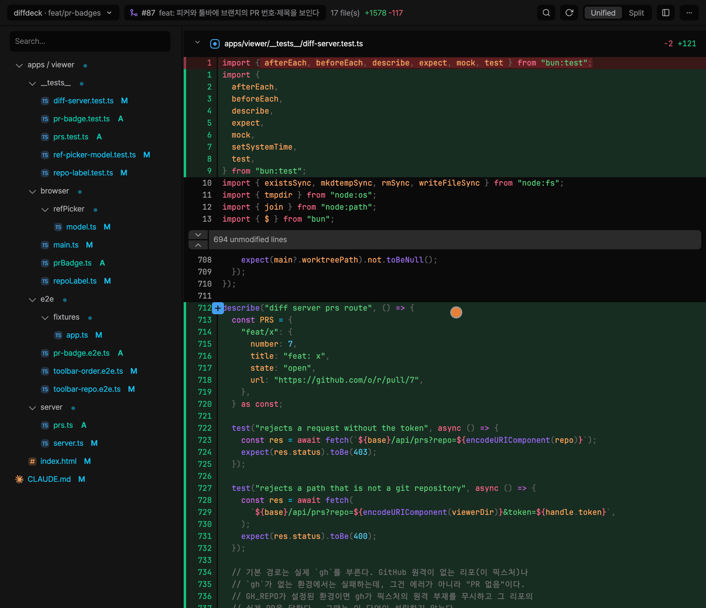
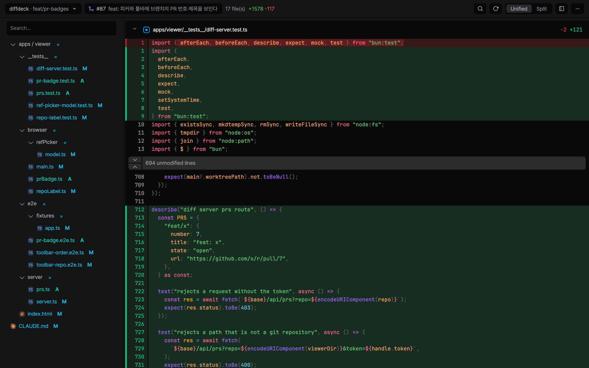
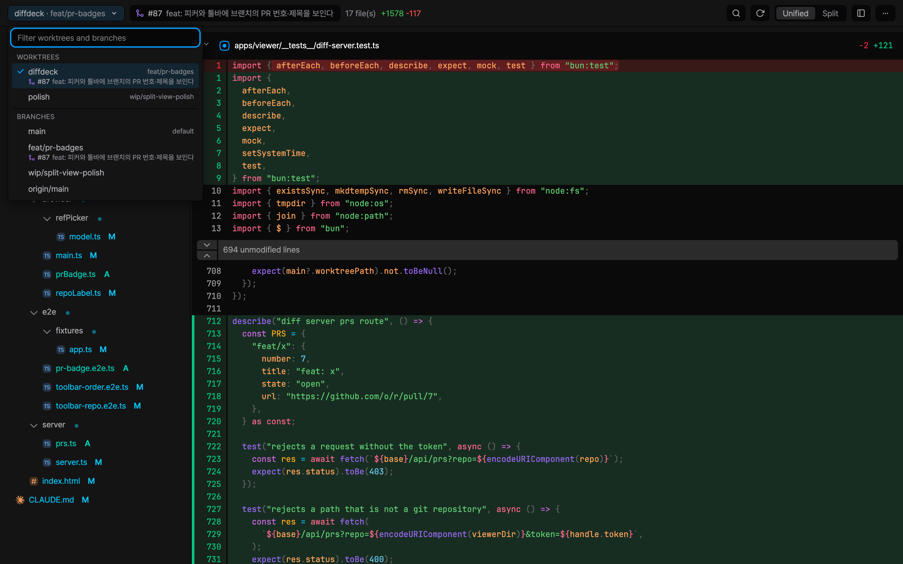
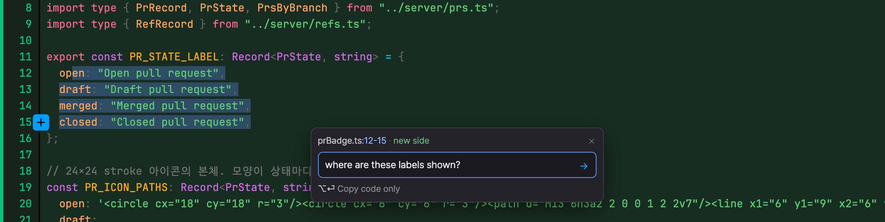

# diffdeck

English | [한국어](docs/README.ko.md) | [日本語](docs/README.ja.md) | [中文](docs/README.zh.md) | [Español](docs/README.es.md)

A local diff viewer, built on a vendored fork of Pierre's [`@pierre/diffs`](https://www.npmjs.com/package/@pierre/diffs) and [`@pierre/trees`](https://www.npmjs.com/package/@pierre/trees).

[](https://www.npmjs.com/package/@say8425/diffdeck)
[](https://www.typescriptlang.org)
[](https://bun.sh)
[](#license)



## What is this?

diffdeck is the local diff viewer originally embedded in [cc-statusline](https://github.com/say8425/cc-statusline), extracted into its own product. Instead of depending on the upstream Pierre packages — which move fast (`@pierre/diffs` churns heavily; `@pierre/trees` is pre-1.0 beta) and whose internal markup we had already coupled to heavily — diffdeck **recovers the original TypeScript from the packages' source maps and vendors it**, so we own the rendering engine outright.

The result is a Bun-workspace monorepo where a commodity-hard, framework-agnostic diff engine (Pierre's `CodeView`, the ~30k lines of `packages/diffs`) is kept as-is, while the parts we customize live in our own code.

## Features

What the diff-rendering engine provides:

- **Syntax-highlighted diffs** via [Shiki](https://shiki.style/) with TextMate themes (light + dark).
- **Full old/new file diffs**, not just patches — so unchanged context can be collapsed and **expanded on demand**.
- **Unified and split** layouts.
- **File-tree sidebar** with git-status badges, natural sort, and **flatten** (compacting single-child folder chains).
- **Image diffs** — changed binary images render inline with old/new panels.
- **Virtualized rendering** that stays smooth on large diffs, with sticky file headers.
- **Shadow-DOM encapsulation** per file, so the viewer's styles never leak into the page.

The interactive viewer chrome that wraps this engine — click-to-fold, copy-path, in-app search, and watch/auto-refresh — comes from the [cc-statusline](https://github.com/say8425/cc-statusline) viewer and now lives in diffdeck's `apps/viewer/`, together with a searchable worktree and branch picker, pull-request badges, and Grab.



### Browse any branch or worktree

The picker at the left of the toolbar chooses what you're looking at, and its label always says where you are: `repo · branch` in the main worktree, `repo / worktree · branch` in a linked one. Type to filter by name, PR number, or PR title.



- Picking a **worktree** opens that worktree's changes.
- Picking a **branch** shows the commits on that branch since it forked from the base — normally the repository's default branch, tagged `default` in the list.

A worktree with nothing uncommitted opens on its branch's commits against the base instead of an empty screen. Branches with a pull request show its number and title in the list, and while you are viewing one, a badge next to the picker opens the PR on GitHub.

### Grab — hand a diff selection to your coding agent

Select code in the diff and a prompt box opens right where you finished selecting. Press <kbd>Enter</kbd> and diffdeck copies **one block** to your clipboard — the file reference, the exact lines you picked, and your prompt — ready to paste into Claude Code, Codex, or any chat. Need only the code? Press <kbd>⌥</kbd><kbd>Enter</kbd> (<kbd>Alt</kbd><kbd>Enter</kbd> on Windows/Linux) and diffdeck copies the picked lines by themselves — no prompt, no fence, no file header — to paste straight into an editor. A selection spanning both sides of the diff comes across without its `+`/`-` markers, so the old and new versions of a line sit one after another.



Two ways in: **select the code text** (drag, double-click, or triple-click), or use the gutter's line selection and its `+` button. A text selection copies exactly the characters you highlighted; the gutter path takes whole lines. Either way the highlight shows precisely what will be copied.

What lands on your clipboard:

````text
```
diffdeck selection
File: apps/viewer/browser/main.ts
Lines: 84-85 (new side, working diff)

if (a) return;
const b = 1;
```
why was this needed?
````

## Installation

Run it on demand — no install needed:

```bash
bunx @say8425/diffdeck
```

Or install it globally to get the `diffdeck` command:

```bash
bun install -g @say8425/diffdeck
```

Requires [Bun](https://bun.sh) and `git` on your `PATH`. [`gh`](https://cli.github.com) is optional: with it, diffdeck uses your pull requests to pick the comparison base and to show PR badges.

## CLI

Run it in any git repository to view its diff:

```bash
bunx @say8425/diffdeck        # or `diffdeck` if installed globally
```

This starts a local server on `127.0.0.1:49573` (override with `--port`) and opens
the viewer in your browser.

Options:

| Flag               | Description                                                      |
| ------------------ | ---------------------------------------------------------------- |
| `--port <n>`       | Port to serve on (default: `$DIFFDECK_PORT` or `49573`)          |
| `--no-open`        | Do not open a browser automatically (the URL is still printed)   |
| `--untracked`      | Start with untracked files included                              |
| `--watch`          | Start with watch (auto-refresh) on                               |
| `--no-flatten`     | Start with the file tree un-flattened (flatten is on by default) |
| `--tree-right`     | Start with the file tree on the right                            |
| `--split`          | Start in split view (unified is the default)                     |
| `--hide-tree`      | Start with the file tree hidden                                  |
| `--fold-with-tree` | Start with sidebar directory collapse synced to diff folds       |
| `-h`, `--help`     | Show help                                                        |
| `-v`, `--version`  | Show version                                                     |

These view flags set the initial state for this launch only — they don't change
your saved preferences, and the in-app toggles reflect the launched state.

Environment: `DIFFDECK_PORT` sets the default port. The token is cached under
`$XDG_CACHE_HOME/diffdeck/`, or `~/.cache/diffdeck/` when that is unset.

## Skills

diffdeck ships an **agent skill** (a single `skills/diffdeck/SKILL.md`) so an AI
coding agent can open the diff viewer in your browser when a change is easier to
see than to read. Install it into your agent through one of the channels below.

The plugin and `npx skills` channels fetch from GitHub, so they need the
repository to be **public** and diffdeck **published to npm** (so the skill's
`bunx @say8425/diffdeck` resolves). The self-contained `diffdeck install-skill`
works from any local install.

### Claude Code

Plugin:

```
/plugin marketplace add say8425/diffdeck
/plugin install diffdeck@diffdeck
```

Or self-contained (writes `~/.claude/skills/diffdeck/`):

```bash
diffdeck install-skill        # --project installs into the current repo instead
```

### Codex

Plugin:

```
codex plugin marketplace add say8425/diffdeck
codex plugin add diffdeck@diffdeck
```

Or self-contained (writes `~/.claude/skills/diffdeck/` and `~/.agents/skills/diffdeck/`):

```bash
diffdeck install-skill --codex
```

### skills

Install into any [supported agent](https://github.com/vercel-labs/skills) with the
`skills` CLI:

```bash
npx skills add say8425/diffdeck
```

The `codex` / `npx skills` subcommands are young — check `codex plugin --help` /
`npx skills --help` for your version.

## Architecture

```
packages/
  path-store/   @diffdeck/path-store   pure tree logic (flatten, sort, projection, store)
  theming/      @diffdeck/theming      theme system + 10 vendored shiki theme JSONs
  diffs/        @diffdeck/diffs         CodeView diff-rendering engine
  trees/        @diffdeck/trees         FileTree engine (vanilla render)
apps/viewer/    @say8425/diffdeck — CLI + diff-server (data API) + browser viewer
skills/         the agent skill (SKILL.md), copied into the package at build time
scripts/        source-map extraction tool, css-inline Bun plugin, render-parity harness
docs/           README translations and screenshots
```

Dependency graph: `path-store` (no deps) ← `trees`; `theming` (shiki) ← `diffs`, `trees`. Runtime externals: shiki + `@shikijs/*`, `diff`, `hast-util-to-html`, `lru_map` — these are the packages' own dependencies; the published CLI bundles everything, so nothing is resolved at install time.

## Development

Requires [Bun](https://bun.sh).

```bash
bun install
bun run typecheck   # per-package tsc
bun test
bun run lint        # oxlint
bun run format      # oxfmt
```

### Testing

Three lanes:

- `bun test` — unit/integration tests, fast. `*.e2e.ts` specs are excluded from
  collection, so this never launches a browser.
- `bun run test:coverage` — the same suite with a **100% coverage gate on
  diffdeck's owned runtime code** (`apps/viewer/{browser,cli,server}`).
  Intentionally out of the gate: the vendored `packages/*`, the tooling under
  `scripts/`, the browser entry `main.ts` (integration entry — exercised by the
  e2e suite instead, not in-process), `build.ts`, and the specs themselves
  (`*.test.ts`, `e2e/**`).
- `bun run test:e2e` — the Playwright real-browser suite (`apps/viewer/e2e/`).
  Drives the system Google Chrome via `channel: "chrome"` (no Chromium
  download) and covers `main.ts` and the vendored render paths end-to-end.

### Render-parity harness

Confirms the forked `CodeView` + `FileTree` actually render:

```bash
bun run scripts/parity/build.ts
cd scripts/parity && python3 -m http.server 8099
# open http://127.0.0.1:8099/index.html
```

## License

**Apache-2.0.** diffdeck vendors source derived from Pierre's `@pierre/*` packages (Apache-2.0, © The Pierre Computer Company), modified under the `@diffdeck/*` namespace. See [`NOTICE`](./NOTICE) and each package's `LICENSE` for full attribution and the required notice of modification.
