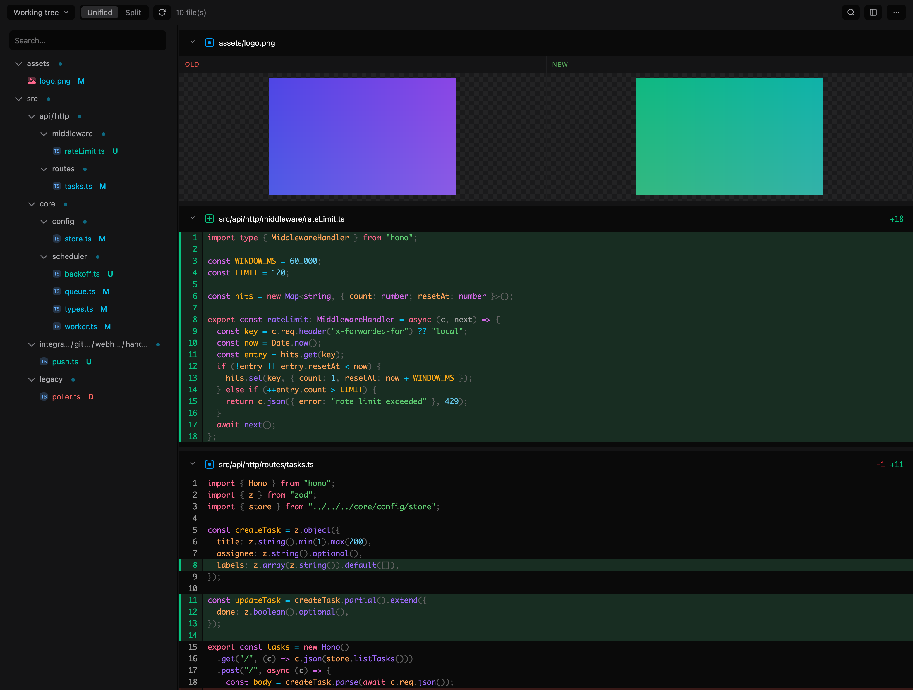

# diffdeck

[English](../README.md) | [한국어](README.ko.md) | [日本語](README.ja.md) | [中文](README.zh.md) | Español

Un visor de diff local, construido sobre un fork vendorizado de los paquetes de Pierre [`@pierre/diffs`](https://www.npmjs.com/package/@pierre/diffs) y [`@pierre/trees`](https://www.npmjs.com/package/@pierre/trees).

[](https://www.npmjs.com/package/@say8425/diffdeck)
[](https://www.typescriptlang.org)
[](https://bun.sh)
[](#licencia)



## ¿Qué es esto?

diffdeck es el visor de diff local que originalmente estaba embebido en [cc-statusline](https://github.com/say8425/cc-statusline), ahora extraído como un producto propio. En lugar de depender de los paquetes originales de Pierre — que evolucionan rápido (`@pierre/diffs` cambia mucho; `@pierre/trees` está en beta pre-1.0) y cuyo markup interno ya estaba fuertemente acoplado a nuestro código —, diffdeck **recupera el TypeScript original a partir de los source maps de los paquetes y lo vendoriza**, de modo que somos dueños por completo del motor de renderizado.

El resultado es un monorepo de workspaces de Bun donde un motor de diff sólido y agnóstico de framework (el `CodeView` de Pierre, ~27k líneas) se mantiene tal cual, mientras que las partes que personalizamos viven en nuestro propio código.

## Características

Lo que ofrece el motor de renderizado de diffs:

- **Diffs con resaltado de sintaxis** vía [Shiki](https://shiki.style/) con temas TextMate (claro + oscuro).
- **Diffs completos de archivo old/new**, no solo patches — de modo que el contexto sin cambios puede colapsarse y **expandirse bajo demanda**.
- Layouts **Unified y Split**.
- **Barra lateral de árbol de archivos** con insignias de estado de git, orden natural, y **flatten** (compactar cadenas de carpetas con un solo hijo).
- **Diffs de imágenes** — las imágenes binarias modificadas se renderizan en línea con paneles old/new.
- **Renderizado virtualizado** que se mantiene fluido en diffs grandes, con cabeceras de archivo fijas (sticky).
- **Encapsulación con Shadow DOM** por archivo, de modo que los estilos del visor nunca se filtran a la página.

El chrome interactivo del visor que envuelve este motor — plegado con clic, copiar ruta, búsqueda integrada, watch/auto-actualización, y modos working-tree-vs-base — proviene del visor de [cc-statusline](https://github.com/say8425/cc-statusline) y ahora vive en `apps/viewer/` de diffdeck.


## Instalación

Ejecútalo bajo demanda — sin necesidad de instalación:

```bash
bunx @say8425/diffdeck
```

O instálalo globalmente para obtener el comando `diffdeck`:

```bash
bun install -g @say8425/diffdeck
```

Requiere [Bun](https://bun.sh); `git` (y `gh` para la detección de branch-vs-base) en tu `PATH`.

## CLI

Ejecútalo en cualquier repositorio git para ver su diff:

```bash
bunx @say8425/diffdeck        # o `diffdeck` si está instalado globalmente
```

Esto inicia un servidor local en `127.0.0.1:49573` (sobrescribible con `--port`) y abre el visor en tu navegador.

Opciones:

| Flag               | Descripción                                                                      |
| ------------------ | --------------------------------------------------------------------------------- |
| `--port <n>`       | Puerto en el que servir (predeterminado: `$DIFFDECK_PORT` o `49573`)              |
| `--no-open`        | No abrir un navegador automáticamente (imprime la URL)                            |
| `--untracked`      | Iniciar incluyendo archivos sin seguimiento (untracked)                           |
| `--watch`          | Iniciar con watch (auto-actualización) activado                                   |
| `--no-flatten`     | Iniciar con el árbol de archivos sin aplanar (flatten está activo por defecto)    |
| `--tree-right`     | Iniciar con el árbol de archivos a la derecha                                     |
| `--split`          | Iniciar en vista split (unified es el valor predeterminado)                       |
| `--hide-tree`      | Iniciar con el árbol de archivos oculto                                            |
| `-h`, `--help`     | Mostrar ayuda                                                                      |
| `-v`, `--version`  | Mostrar versión                                                                    |

Estos flags de vista establecen el estado inicial solo para este lanzamiento — no cambian tus preferencias guardadas, y los toggles dentro de la app reflejan el estado con el que se lanzó.

Entorno: `DIFFDECK_PORT` establece el puerto predeterminado. El token se guarda en caché bajo `~/.cache/diffdeck/`.

## Skills

diffdeck incluye una **skill de agente** (un único `skills/diffdeck/SKILL.md`) para que un agente de codificación con IA pueda abrir el visor de diff en tu navegador cuando un cambio es más fácil de ver que de leer. Instálala en tu agente a través de uno de los canales de abajo.

Los canales de plugin y `npx skills` obtienen los datos desde GitHub, así que necesitan que el repositorio sea **público** y que diffdeck esté **publicado en npm** (para que el `bunx @say8425/diffdeck` de la skill se resuelva). El comando autocontenido `diffdeck install-skill` funciona desde cualquier instalación local.

### Claude Code

Plugin:

```
/plugin marketplace add say8425/diffdeck
/plugin install diffdeck@diffdeck
```

O autocontenido (escribe en `~/.claude/skills/diffdeck/`):

```bash
diffdeck install-skill        # --project instala en el repositorio actual en su lugar
```

### Codex

Plugin:

```
codex plugin marketplace add say8425/diffdeck
codex plugin add diffdeck@diffdeck
```

O autocontenido (escribe en `~/.claude/skills/diffdeck/` y `~/.agents/skills/diffdeck/`):

```bash
diffdeck install-skill --codex
```

### skills

Instálalo en cualquier [agente compatible](https://github.com/vercel-labs/skills) con la CLI `skills`:

```bash
npx skills add say8425/diffdeck
```

Los subcomandos `codex` / `npx skills` son recientes — revisa `codex plugin --help` / `npx skills --help` para tu versión.

## Arquitectura

```
packages/
  path-store/   @diffdeck/path-store   lógica pura de árbol (flatten, sort, projection, store)
  theming/      @diffdeck/theming      sistema de temas + 10 JSONs de temas shiki vendorizados
  diffs/        @diffdeck/diffs         motor de renderizado de diffs CodeView
  trees/        @diffdeck/trees         motor FileTree (render vanilla)
apps/viewer/    @say8425/diffdeck — CLI + diff-server (API de datos) + visor de navegador + skill de agente
scripts/        herramienta de extracción de source maps, plugin de Bun css-inline, arnés de paridad de renderizado
```

Grafo de dependencias: `path-store` (sin dependencias) ← `trees`; `theming` (shiki) ← `diffs`, `trees`. Externals en runtime: shiki + `@shikijs/*`, `diff`, `hast-util-to-html`, `lru_map`.

## Desarrollo

Requiere [Bun](https://bun.sh).

```bash
bun install
bun run typecheck   # tsc por paquete
bun test
bun run lint        # oxlint
bun run format      # oxfmt
```

### Pruebas

Tres carriles:

- `bun test` — tests unitarios/de integración, rápidos. Las specs `*.e2e.ts` quedan excluidas de la recolección, así que esto nunca lanza un navegador.
- `bun run test:coverage` — la misma suite con una **puerta de cobertura del 100% sobre el código de runtime propio de diffdeck** (`apps/viewer/{browser,cli,server}`). Intencionalmente fuera de la puerta: los `packages/*` vendorizados, el punto de entrada del navegador `main.ts` (entry de integración — ejercitado por la suite e2e en su lugar, no in-process), y `build.ts`.
- `bun run test:e2e` — la suite de Playwright con navegador real (`apps/viewer/e2e/`). Conduce el Google Chrome del sistema vía `channel: "chrome"` (sin descarga de Chromium) y cubre `main.ts` y las rutas de render vendorizadas de extremo a extremo.

### Arnés de paridad de renderizado

Confirma que el `CodeView` + `FileTree` bifurcados realmente renderizan:

```bash
bun run scripts/parity/build.ts
cd scripts/parity && python3 -m http.server 8099
# abre http://127.0.0.1:8099/index.html
```

## Licencia

**Apache-2.0.** diffdeck incorpora código derivado de los paquetes `@pierre/*` de Pierre (Apache-2.0, © The Pierre Computer Company), modificado bajo el espacio de nombres `@diffdeck/*`. Consulta [`NOTICE`](../NOTICE) y el `LICENSE` de cada paquete para la atribución completa y el aviso de modificación requerido.
